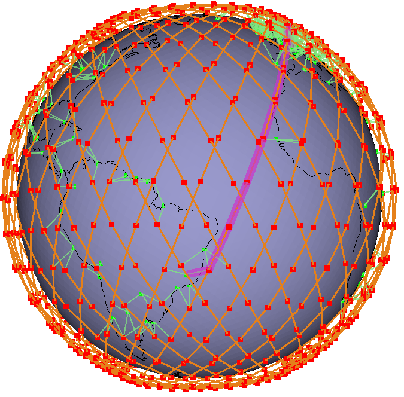

  

README
===

This project is Experiments repository of the "Distributed routing analysis for Satellite Swarms on Low Earth Orbits" paper.
This is a fork of [silleo-scns](https://github.com/Ben-Kempton/SILLEO-SCNS). We have added the ability of choosing different **Routing Protocols**. 
Also, we have added ways of collecting statistics of simulation executions. A Jupyter Notebook contains all the statistical analysis of the experiments.
Simulation logs are stored in `data/` folder.

**Abstract**

*Satellite constellations in Low Earth Orbits (LEO) have emerged as an essential solution for providing continuous global connectivity. However, efficient and scalable routing in these highly dynamic environments remains challenging. This paper comparatively evaluates three prominent routing protocols—Ad hoc On-Demand Distance Vector (AODV), Greedy Perimeter Stateless Routing (GPSR), and Open Shortest Path (OSPF)—through extensive simulations using the Silleo-scns simulator. We analyze key performance metrics, including route stability, hop count, execution time, error rate, and overall success rate. Our results highlight OSPF's superiority in stability and accuracy due to its orbital prediction capabilities, while GPSR provides advantageous scalability and low computational overhead. Conversely, AODV demonstrates significant performance limitations under dynamic topology changes typical of satellite constellations. These insights contribute to informed routing protocol selection and future optimization strategies for satellite swarm networks.*

## Getting started:
* All of my development and testing has been done with linux mint 19.3, with kernel version 5.3
* [Install Guide](installguide.md)
* [User Guide](userguide.md)

## Route Computation Examples

  
  
  

The images above show examples of route computation for AODV (left), GPSR (middle), and OSPF (right) routing protocols in the satellite swarm network simulation.

